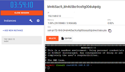
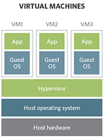
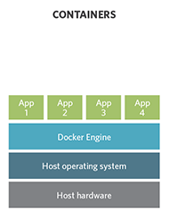
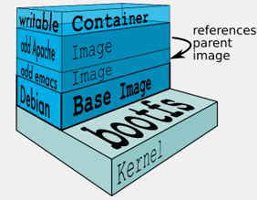
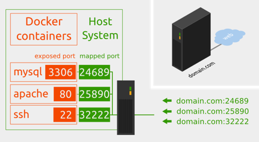
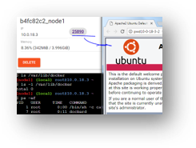
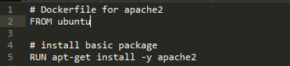
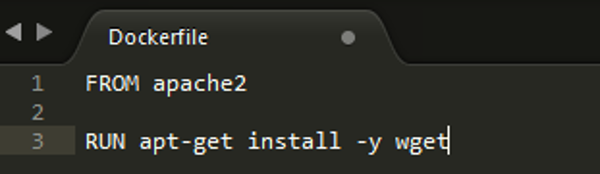
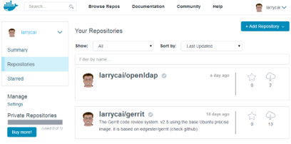
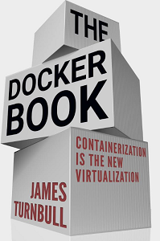

name: inverse
layout: true
class: center, middle, inverse, hidefooter
---
# Learn Docker in 90 minutes
[codingwithme]
.footnote[author: [larry.cai](mailto:larry.caiyu@gmail.com), slides: [remark](https://github.com/gnab/remark)]

---
layout: true
class: footer-version
---
# Agenda
.left-column[

]
.right-column[
### Exercised based training to understand basic concepts of **docker**

- Exercise 1: First docker container

- Exercise 2: Add package and create own docker image

- Exercise 3: Understand layer

- Exercise 4: Expose the service

- Exercise 5: Dockerfile to build

- Exercise 6: Share your image with others

- Summary & Reference 
]

---
# Environment
.left-column[
## docker-playground

### training env

]
.right-column[
Use Google's http://labs.play-with-docker.com

* Exposed port will be automatically visible as link
* One terminal shell for one instance, create another instance and ssh to have another terminal

```bash
kubeadm join –token … # check the console log in Node 1
```
- Click the port to open dashboard
- Check inside master node (Node 1)
```bash
kubectl get nodes
```

> Node 1 needs to install dashboard, check Step3 in [codingwithme-k8s](https://github.com/larrycai/codingwithme-k8s)

.footnote[.red[*] Use `Ctrl+Ins` and `Shift+Ins` for copy/paste the command in the console]
]
---
# Introduction
.left-column[
## Container vs VirtualMachine

.footnote[.red[*]mostly when people talks about<br/>
docker, it points to container]
]
.right-column[
Container technology offers an alternative method for virtualization in cloud, with more efficiency & fast

- Based on LXC (Linux Container), easy to use.
- Similar to VM as end-user with different features

Docker is one execution engine for container 

 
]
---
# Exercise 1
.left-column[
## First docker container 
]
.right-column[
* Download from central place for ubuntu

```bash
$ docker search ubuntu  # from lots of release in internet
$ docker pull ubuntu
Using default tag: latest
latest: Pulling from library/ubuntu
38e2e6cd5626: Pull complete
...
Digest: sha256:cae64d9f29ff25132ea0989b029ff3bbc53013305797e29d549acd5471bf3894
Status: Downloaded newer image for ubuntu:latest
$ docker images
REPOSITORY          TAG                 IMAGE ID            CREATED             SIZE
ubuntu              latest              20bb25d32758        15 hours ago        87.5MB
```
- Execute command directly

```bash
$ docker run ubuntu echo “Hello World”
```
- Interactive with container (-i : interactive, -t: tty)

```bash
$ docker run -i -t ubuntu bash
# uname –a
# dpkg –l 
```
]

---
# `docker`
.left-column[
the command line tool
]
.right-column[
Some common commands:
```bash
$ docker search # search hub.docker.com for an image
$ docker pull     # download image
$ docker images # list all existing local images
$ docker run  # initiates a container from an image
$ docker ps    # list running containers
$ docker build # build images from Dockerfile
```
Not so important in beginning
```bash
$ docker start/stop/kill # commands
$ docker rm/rmi to remove a container or image
```
see http://superuser.com/questions/756999/whats-the-difference-between-docker-stop-and-docker-kill 

]
---
# Exercise 2
.left-column[
## Add own package and image
]
.right-column[
Try to install apache2 inside 

```bash
$ docker run -i -t ubuntu bash
# apt-get update && apt-get install -y apache2
# exit
$ docker ps –l # -l means –latest
CONTAINER ID        IMAGE               COMMAND             CREATED             STATUS
c4bd63cc87f1        ubuntu:latest       "bash"              2 minutes ago       Exited 2 sec
$ docker commit <container id> apache2
66db661d9ad8681b082bb62b21b6ef5f2ddb4799e3df5dbd8fb23aed16616b1d
```

Check and run it again to see if the apache is there

```bash
$ docker images
REPOSITORY          TAG                 IMAGE ID            CREATED             SIZE
apache2             latest              bba7522acfbe        4 seconds ago       208MB
ubuntu              latest              20bb25d32758        15 hours ago        87.5MB
$ docker run -i -t apache2 bash 
```

.red[Question]:  Apache binary & Process exists ? Why ?
]
---
# Docker
.left-column[
## image & layer
]
.right-column[
Docker images are saved in layered !!
* Differed binary for apache2 image

See the image tree

```bash
$ docker run -it --rm -v /var/run/docker.sock:/var/run/docker.sock \
  nate/dockviz images -t
├─<missing> Virtual Size: 87.5 MB
│ └─<missing> Virtual Size: 87.5 MB
│   └─<missing> Virtual Size: 87.5 MB
│     └─<missing> Virtual Size: 87.5 MB
│       └─20bb25d32758 Virtual Size: 87.5 MB Tags: ubuntu:latest
│         └─bba7522acfbe Virtual Size: 207.7 MB Tags: apache2:latest
```

see  [docker images & layers](https://docs.docker.com/storage/storagedriver/)


> Note: For -v /var/run/docker.sock:/var/run/docker.sock, It is docker in docker technology, see https://github.com/justone/dockviz (not important for beginner, focus on layer)
]
---
# Docker
.left-column[
## image & layer
]
.right-column[
When Docker mounts the rootfs, it starts read-only, it takes advantage of a union mount (like `aufs`,`overlayfs`) to add a read-write file system over the read-only file system. 



There may be multiple read-only file systems stacked on top of each other. We think of each one of these file systems as a layer.

see https://docs.docker.com/storage/storagedriver/overlayfs-driver/
]
---
# Exercise 3
.left-column[
## Understand the layer
]
.right-column[
Try

```bash
docker run -it --rm -v /var/run/docker.sock:/var/run/docker.sock \
	nate/dockviz images -t
```

Data are stored under `/var/lib/docker` (root permission), `overlay2` is used now, could be others like `aufs`

```bash
ls -1 /var/lib/docker/overlay2
..
66db661d9ad8681b082bb62b21b6ef5f2ddb4799e3df5dbd8fb23aed16616b1d/
9db365ecbcbbb20e063eac70842c53e27fcad0e213f9d4ddb78152339cedd3b1/
See what is inside /var/lib/docker/overlay2  !!
# find /var/lib/docker/overlay2 | grep apache2

```

> Understand the layer similar with how `git diff` works 

]
---
# Docker
.left-column[
## Service
]
.right-column[
Network in container is not visible outside (using NAT)

The service is exposed by Port !!
Run `–p host:guest # assign port to host`



```bash
$ docker run –p 25890:80 –i –t apache2 bash
# apache2ctl start
```

picture source: https://www.yabage.me/2014/06/02/hosting-docker-containers/

]
---
# Docker
.left-column[
## Service
]
.right-column[
Interactive mode vs. Daemon (Deattach) mode 

docker run

* -d           : run in daemon mode (`docker run -d -p 25890:80 apache2`)
* -i           : run in interactive mode

Enter into existing docker container
 
```bash
$ docker exec -it <container ID> bash
```

> `docker exec` is one of the most important command, uses it instead of `ssh` 
]
---
# Exercise 4
.left-column[
## expose the service


]
.right-column[

Export the port to host as 25890 and start the service manually
```bash
$ docker run -p 25890:80 –i -t apache2 bash
root@35ac981a49e5:/# service apache2 start
$ docker ps  # in another shell (mostly need ssh to this)
CONTAINER ID        IMAGE               ….        STATUS              PORTS                  NAMES
e020aa2c02a5        apache2:latest      …..       Up 14 seconds       0.0.0.0:25890->80/tcp   web
$ curl http://localhost:25890 
```

Come into the container again to check

```bash
$ docker exec –it e020aa2c02a5 bash
# ps –ef # check apache process
```

Run container in daemon mode and access 25891

```bash
$ docker run –p 25891:80 –d –t apache2 apache2ctl –D FOREGROUND
```

> Note, if you run it in local docker server, try to access it in shell & local browser and access your friend’s web page?

]
---
# Dockerfile
.left-column[

.footnote[.red[very very] useful]
]
.right-column[
Dockerfile instructs on how to build the image automatically



Dockerfile Syntax (INSTRUCTION arguments)

<pre>
FROM – defines base image
RUN   - executes arbitrary command
ENV – sets environment
EXPOSE – expose a port
COPY - copy local file
CMD – default command to execute
LABEL – metadata information
...
</pre>

Used by `docker build-f Dockerfile -t apache2 . # default is Dockerfile`

see https://docs.docker.com/engine/reference/builder/

]
---
# Exercise 5
.left-column[
## Dockerfile apache2/wget
]
.right-column[
Create the Dockerfile



```bash
$ vi Dockerfile
$ docker build –t wget .
```

Start the `wget` image and verify !!
]
---
# Share
.left-column[
## docker image in registry
]
.right-column[
Docker is also a tool for sharing. A .red[registry/repository] is a sharable collection of tagged images that together create the file systems for containers.

Default is dockerhub: https://hub.docker.com/
 
Public repo.  `<username>/<repo_name>`

Trusted image is auto-build by docker hub service

`$ docker search/pull/login/push`





]
---
# Summary
.right-column[
This is getting started training slides, door is open to you.

Benefit and use case will be added with your growing competence

Docker grows very fast, follow it.



* [The docker book](https://dockerbook.com/)
]

---
# Changelog
.right-column[
* 2014/05/23: first release https://www.slideshare.net/larrycai/learn-docker-in-90-minutes
* 2014/12/31: docker exec instead of attach, MacOS, Add books
* 2016/09/06: docker image layers are different since 1.10
* 2017/07/27: update to latest version 17.06
* 2019/01/23: revisit using remark slide
]
---
name: last-page
template: inverse

## That's all folks (for now)!

created using [remark](http://github.com/gnab/remark).

.footnote[fork me @ [github](https://github.com/larrycai/codingwithme-docker)]

